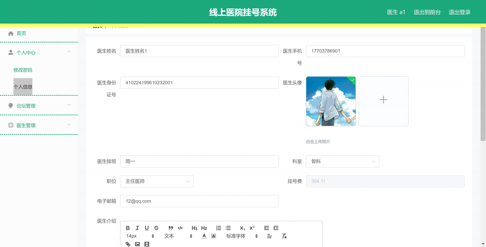
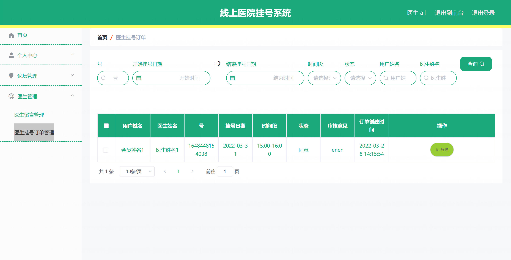
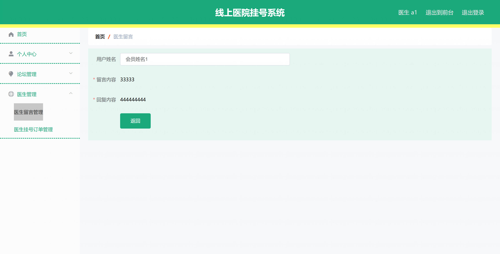
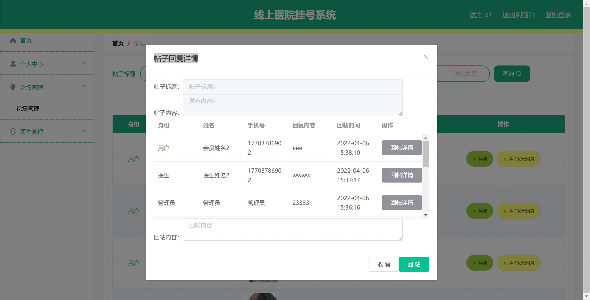
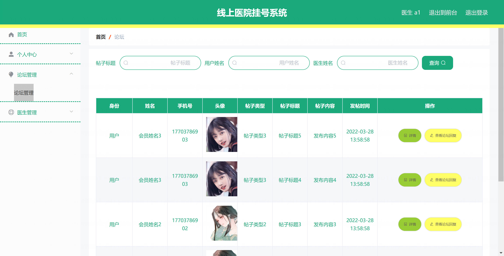
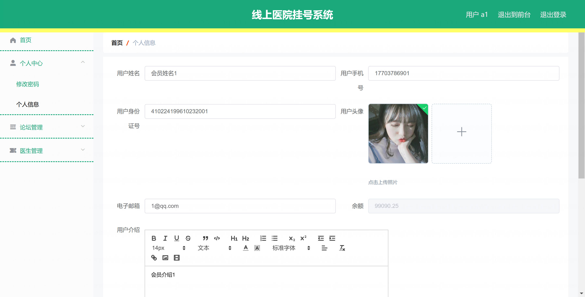
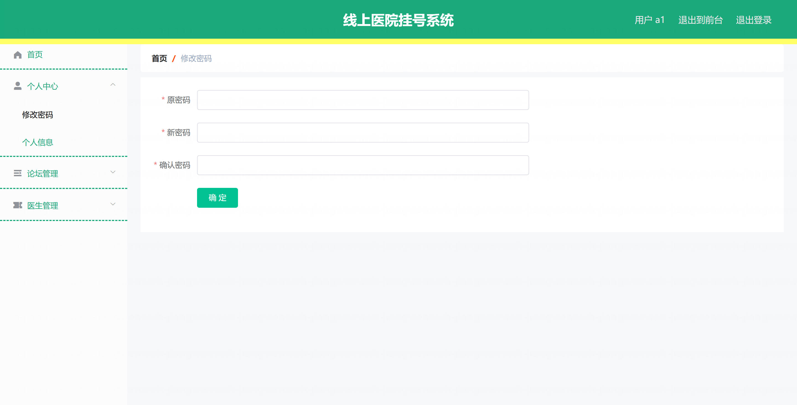
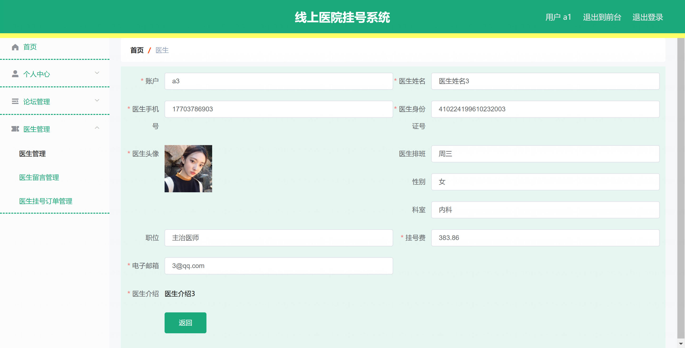

基于Springboot的线上医院挂号与后台管理系统（程序+论文）
=

### 完整代码获取地址：从戎源码网 ([https://armycodes.com/](https://armycodes.com/))
### 作者微信：19941326836  QQ：952045282 
### 承接计算机毕业设计、Java毕业设计、Python毕业设计、深度学习、机器学习
### 选题+开题报告+任务书+程序定制+安装调试+论文+答辩ppt 一条龙服务
### 所有选题地址https://github.com/nature924/allProject

一、项目介绍
---

基于 Spring Boot 的线上医院挂号与后台管理系统，主要参与角色为：后台管理员、普通用户/会员、专家。主要功能模块和各角色职责如下：

用户 / 会员（前端用户）：
登录/注册/登出/找回密码
浏览专家列表、查看专家详情
发起挂号预约（订单）、查看订单详情、取消预约
论坛发帖/评论、查看专家留言

专家：
专家注册、资料维护、查看个人预约/订单
接收/处理预约（含审核 shenhe）
回应留言、参与论坛互动

后台管理员（管理端）：
用户/会员/专家 管理：分页/列表/详情/新增/修改/删除/批量导入
订单管理：分页/审核/详情/删除
论坛与留言管理：帖子管理、留言管理

二、项目技术
---
- 编程语言：Java
- 数据库：MySQL
- 项目架构：B/S架构
- 前端技术：JSP
- 后端技术：Spring、SpringMVC、MyBatis

三、运行环境
---
- 操作系统：Windows、macOS都可以
- JDK版本：JDK1.8以上都可以
- 开发工具：IDEA、Ecplise、Myecplise都可以
- 数据库: MySQL5.7以上都可以
- Tomcat：任意版本都可以
- Maven：任意版本都可以

四、运行截图
---
### 论文截图：

### 程序截图：

